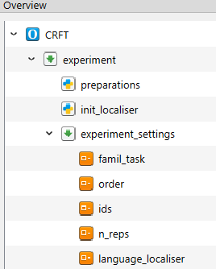
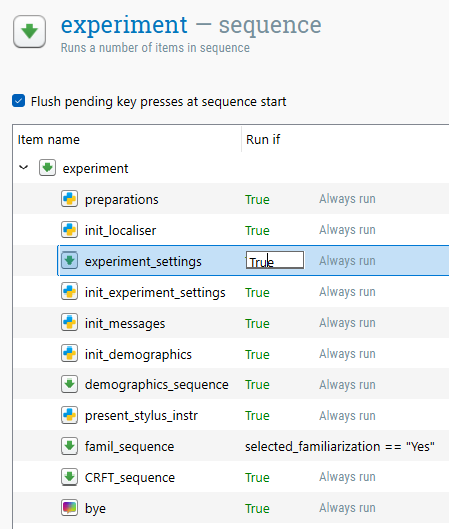
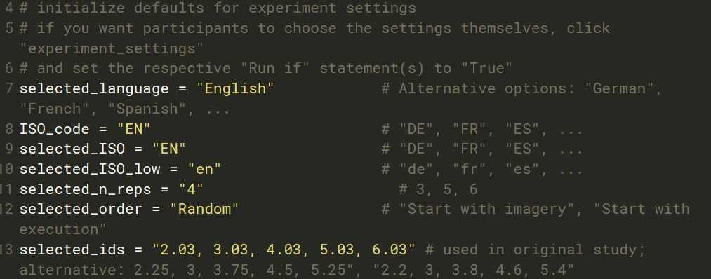
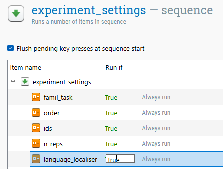

# CHRONOMETRIC RADIAL FITTS' TASK (CRFT)

**Author:** Carla Czilczer  
**Software used:** OpenSesame 4.0.24  
**Experiment Type:** Local  
**Input device:** Touchscreen with active stylus only  
**Languages supported:** English (EN) = default, German (DE), Spanish (ES), and French (FR). Further languages can be added, which requires updating the `.xlsx` files (see [language localization](#language-localization)).  

---------------------------------------
## GENERAL INSTRUCTIONS

This experiment is built using [OpenSesame](https://osdoc.cogsci.nl/4.0/) 4.0.24. To run this experiment locally, it utilizes the [xpyriment](https://osdoc.cogsci.nl/4.0/manual/backends/) backend. Please use the specified OpenSesame version and backend, because changes in version or backend can affect stimulus presentation, timing, and touchscreen/stylus response collection.  

This README specifically details the structure and customization of this implementation of the **Chronometric Radial Fitts' Task (CRFT)**. The task comprises an **execution** condition and an **imagery** condition. In the execution condition, participants physically tap visual targets with a stylus. In the imagery condition, participants imagine the same tapping movements. In both conditions, space-bar presses are used to mark the movement sequence and derive movement times.

> **Important:** This implementation is designed for use with a **touchscreen and active stylus**. The mouse cursor is hidden during task-relevant displays. A conventional mouse is not intended as an alternative response device for data collection with this version of the task.

---------------------------------------
## SETUP INSTRUCTIONS

To edit or run this task locally, you need to have **OpenSesame 4.0.24** installed on the data collection computer.  
A script for data preparation in [R](https://www.r-project.org/) (developed with R 4.5.2) is provided.  

**Step-by-step instructions:**  
1. **Download** and unzip the repository (all files) to a dedicated folder with no other experiment files in it.
2. **Open** the file `CRFT_local.osexp` in OpenSesame 4.0.24.
3. Ensure that the experiment is run with the saved **xpyriment** backend configuration.
4. If required: **Adapt** the [experiment settings](#available-parameters) and save them.
5. Before data collection, **check the display size and stylus input** as described in [Screen setup and physical target size](#screen-setup-and-physical-target-size).
6. Click the **green triangle** to run the experiment.
7. For each run, **save** the corresponding `.csv` file in the `data` folder located inside the unzipped repository. **Do not rename the files.** The `data-prep.R` script requires the standard naming format `subject-<subject_nr>.csv` (e.g., `subject-1.csv`, `subject-2.csv`).
8. **Process the data** using the provided `data-prep.R` script.

### Screen setup and physical target size

The CRFT implementation used for the experiment by **[Czilczer et al., 2026](https://doi.org/10.3758/s13428-026-03124-8)** was administered using:

| Hardware component | Specification |
| :--- | :--- |
| Touchscreen monitor | Philips 242B9TL/00, 23.8 inch / 60.5 cm |
| Documented monitor resolution | 1920 × 1080 pixels at 60 Hz |
| Operating system | Windows 10 |
| Input device | Hama Stylus Pro 00125113, active stylus with 1.5 mm tip |

The monitor model specifications are documented by Philips in the product specification sheet for the Philips 242B9TL/00.

> **⚠️ Important:** Do **not** change the resolution in the OpenSesame experiment properties. The stored resolution belongs to the experiment configuration and is required to retain the present stimulus geometry.

The default movement-difficulty values in this implementation are:

`2.03, 3.03, 4.03, 5.03, 6.03`

For the physical setup used in the **[Czilczer et al. (2025)](https://doi.org/10.31234/osf.io/c2mw6_v2)** experiment, these default values correspond approximately to:

| Stimulus property | Approximate physical size on screen |
| :--- | ---: |
| Radial amplitude | ~12.50 cm |
| Largest target diameter (`ID = 2.03`) | ~6.10 cm |
| Smallest target diameter (`ID = 6.03`) | ~0.38 cm |

To reproduce the task with physically comparable target sizes, use a touchscreen of comparable dimensions and measure the target display directly on the screen before data collection. If the targets appear physically too small on a new setup, adjust the **computer/Windows display resolution or scaling** rather than the OpenSesame experiment resolution.

---------------------------------------
## LANGUAGE LOCALIZATION

This experiment uses external `.xlsx` files to manage text and translations. This makes adding new languages relatively easy, but strict formatting rules apply.

**How it works:** Within the experiment, either a default language can be configured (see [changing defaults](#Changing-the-Defaults)), or participants can select their preferred language at the start, otherwise, the default “English” is applied). The experiment uses the corresponding _ISO_code_ (e.g., "EN", "DE") to retrieve the corresponding text from columns in the external `.xlsx` files (e.g., `Instructions.xlsx`, `Block_messages.xlsx`).

## **Adding a new language:**
### 1. Open the relevant `.xlsx` files
- `Language_localiser.xlsx`
- `Demographics.xlsx`
- `Messages.xlsx`

### 2. Extend `language_localiser-semicolon.xlsx` by adding a new row  
**| language | ISO_code |**
| :--- | :--- | 
| English | EN | 
| Spanish | ES | 
| German | DE | 
| French | FR |

Add your new language (e.g., Italian) by inserting the _language_ and _ISO_code_ in a **new row**:
**| language | ISO_code |** 
| :--- | :--- | 
| English | EN | 
| Spanish | ES | 
| German | DE | 
| French | FR |
| Italian | IT |

### 3. Extend the files `Demographics.xlsx`, `Messages.xlsx`, `Instructions.xlsx`, `Block_messages.xlsx` by adding a new column
Example: `Messages.xlsx`
| message | EN | ES | DE | FR |
| :--- | :--- | :--- | :--- | :--- |
| welcome_msg | Welcome to the experiment! | Bienvenido/a al experimento! | Willkommen zum Experiment! | Bienvenue dans l'expérience ! |
| adv_msg | Press SPACE to continue | Presiona ESPACIO para continuar | Drücken Sie die Leertaste um fortzufahren | Appuyez sur ESPACE pour continuer |
| bye_msg | You have finished the experiment | Has terminado el experimento | Sie haben das Experiment beendet | Vous avez terminé l'expérience |

Add a **new column** using the _ISO_code_ (`IT`), and enter translations at the end of each row:
| message | EN | ES | DE | FR | IT |
| :--- | :--- | :--- | :--- | :--- | :--- |
| welcome_msg | Welcome to the experiment! | Bienvenido/a al experimento! | Willkommen zum Experiment! | Bienvenue dans l'expérience ! | Benvenuti all'esperimento! |
| adv_msg | Press SPACE to continue | Presiona ESPACIO para continuar | Drücken Sie die Leertaste um fortzufahren | Appuyez sur ESPACE pour continuer | Premere lo SPAZIO per continuare |
| bye_msg | You have finished the experiment | Has terminado el experimento | Sie haben das Experiment beendet | Vous avez terminé l'expérience | Avete terminato l'esperimento |

⚠️Do this for each of the listed `.xlsx` files!

### 4. Update the experiment
1. Open the experiment file `CRFT_local.osexp`
2. Go to the **overview tab**
3. In the `experiment_sequence`, click on `language_localiser`
4. In the window with listed language names, add your new language name (e.g., `Italian`) in a new row — it must exactly match the entry in your `language_localiser.xlsx`

### 5. Reload the updated `.xlsx` files into the file pool
1. Open the file pool (folder icon with image) 
2. Click the **green plus** button
3. Select the updated `.xlsx` files you updated and upload them — they will replace the old ones
4. Save the experiment
---
> **⚠️ Important:** When editing the `.xlsx` files to add translations or change text, you **MUST use HTML tags** to format text directly. 

Common HTML tags used for this experiment:
* `<b>Text</b>` : Makes text **bold**.
* `<br>` : Inserts a line break (new line).
* `<i>Text</i>` : Makes text *italic*.

If you do not use HTML tags, the formatting will not appear correctly in the experiment.  
When adding a new language, you must manually insert line breaks using `<br>` within the cell. Otherwise, longer instructions will be truncated.

> **⚠️ Important:** You must **MUST NOT** change the names of the folders or files, as this will cause the experiment to crash. Additionally, do not change any variable names; the experiment logic depends on these specific identifiers, and renaming them requires updating the underlying code. Do not move files after decompressing the repository. Any deviation from the original file structure or naming will lead to a crash.


_For more information on how to implement a language localizer in OpenSesame, see this [Language Localisation Demo](https://github.com/carlacz/OpenSesame_Language-Localisation-Demo/edit/main/Language_localiser_local)._

---------------------------------------
## TECHNICAL DETAILS

The decompressed repository includes the following files and subfolders:

* `CRFT_local.osexp`: The main experiment file; needed to run the task and change experiment settings.
* `Language_localiser.xlsx`: Configuration file for language selection (language + ISO code).
* `Demographics.xlsx`: Questions and translations for the demographics forms.
* `Messages.xlsx`: Dynamic task instructions, task messages, comprehension-check text, and completion text.
* Image files stored in the OpenSesame file pool: visual materials for instructions and task-related displays.
* **ZIP-file** `crft_images.zip`: `.png` files for all visual stimuli.
* **Folder** `data`: Folder designated for storing the `.csv` files (one per participant/run).
* `data-prep.R`: R script that reads all `subject-*.csv` files automatically, generates `data.rdata`, and stores it in the `data` folder. `data.rdata` contains `data_long` and `data_wide`.

### Stylus response collection

The current CRFT implementation is designed for a touchscreen with active stylus:

* The stylus is handled as a touchscreen/mouse-like primary click response by OpenSesame.
* The timing measure is defined by space-bar events, while screen contact (during execution and imagery) is available as a trial-level control variable (e.g., data quality check).

---------------------------------------
## EXPERIMENT SETTINGS (parameters to choose)

The experiment file allows you to customize various settings. In the **Overview** tab, under the item `experiment_settings`, you will find the following variables that can be modified:  


By default, **the experimenter will set these settings** via dialog boxes **at the beginning of each run**.  

### Available Parameters

| Variable | Options | Description |
| :--- | :--- | :--- |
| `selected_familiarization` | • Yes<br>• No | Determines whether the familiarization task is administered. |
| `selected_language` | • **English** (Default)<br>• German<br>• French<br>• Spanish | Sets the language used for dynamically loaded instructions and messages. |
| `selected_order` | • **Random** (Default)<br>• Start with imagery<br>• Start with execution | Determines the order of the imagery and execution conditions. |
| `selected_ids` | • **2.03, 3.03, 4.03, 5.03, 6.03** (Default; original study)<br>• 2.2, 3, 3.8, 4.6, 5.4<br>• 2.25, 3, 3.75, 4.5, 5.25 | Sets the movement difficulty (ID) values used to calculate target sizes. |
| `selected_n_reps` | • 3<br>• **4** (Default; i.e., 20 trials for each of the two (execution, imagery) testblocks)<br>• 5<br>• 6 | Sets the number of repetitions per selected target difficulty (ID) in each condition. |

### Disable Parameter Selection 
Instead of selecting the experiment settings at the beginning of each run, it is possible to **hard-code defaults** and **disable the manual selection** of specific (or all) settings:

In OpenSesame, you can **disable specific sequences or items** by clicking on the parent sequence in the Overview tab. 
In the tab that opens on the right, you will see a **Run if** statement next to each item. Set this statement to `False` instead of `True` to disable it. If you disable the whole `experiment_settings` sequence within the `experiment` sequence (see below), the **Default settings** listed in the table above will be used.   
 

### Changing the Defaults 
You can also **change the defaults** by hard-coding new values within the script.  
To do this: 
1. Go to the **Overview** tab. 
2. Click on the `preparations` inline script. 
3. Modify lines **7-13** to your desired values. 
You **MUST NOT** modify any other lines in the script!  

> **⚠️ Important:** If you change the default language, you must update **four** related variables to match the ISO codes found in `Language_localiser.xlsx`. You must update: `selected_language`, `ISO_code`, `selected_ISO`, and `selected_ISO_low`. 


Example configuration:

```python
selected_language = "English"
selected_order = "Random"
selected_n_reps = "3"
selected_ids = "2.03, 3.03, 4.03, 5.03, 6.03"
```

Instead of disabling the whole `experiment_settings` sequence, you can also set defaults for specific settings only. For instance, if your whole sample is German-speaking, you can hard-code the language default in the `preparations` inline script (see above) and disable only the `language_localiser` item (see below).  



### Disable Demographic Questions
The experiment includes three demographic questions (Age, Sex, Handedness) by default. We incorporate these questions to facilitate the **creation of norms** that will facilitate the interpretation of individual scores.  

**We welcome contributions to this initiative!** If you wish to submit your data, please follow the steps outlined on the [platform website](https://movementimageryability.github.io/#contribute). When uploading data from specific populations (e.g., stroke patients), please ensure you provide the necessary context.
If you do not wish to contribute, you can disable the demographic questions. 
1.  Click on the `experiment` item in the Overview tab.
2.  Locate the `demographics_sequence` in the tab to the right. 
3.  Change the corresponding “Run if” from “True” to “False”.

### Saving
To try out the experiment after changing settings or adding a new language, click on the blue play button. (This mode is **not** suitable for data collection, only for debugging!)

Once you have finished your configuration, you must **save** the experiment.

---------------------------------------
## PARTICIPANT WORKFLOW:

The participant workflow starts after the experiment settings have been selected.
1. **Experiment settings:** Language, task settings, condition order, and related options are selected.
2. **Demographics:** Participants complete a basic form (age, sex, handedness).
3. **Stylus instructions:** Participants are informed about how to use the touchscreen and active stylus.
4. **Familiarization task:** Presented if selected. Participants tap 70 targets of varying sizes that appear successively on the screen and receive feedback on their tapping accuracy (~2 minutes including instructions).
5. **First condition:** Instructions, multiple-choice comprehension check (repeats until correct response is given), practice block (four trials), testblock (5 * n_reps trials) for either execution or imagery (depending on `selected_order`)
6. **Second condition:** Instructions, multiple-choice comprehension check (repeats until correct response is given), practice block (four trials), testblock (5 * n_reps trials) for the remaining condition.
7. **Completion:** Final completion screen.

#### CRFT trial procedure
The sequence of a single CRFT trial is as follows:
1. **Trial start display:**  
   * In the execution condition, the participant taps the orange central start circle with the stylus.  
   * In the imagery condition, the participant presses the space bar.
2. **Countdown:** A three-second countdown is presented.
3. **Movement sequence:** The participant marks the sequence using 11 space-bar presses.  
   * In execution, participants physically tap the displayed circles with the stylus while simultaneously pressing the space bar.
   * In imagery, participants imagine the tapping sequence while pressing the space bar.
4. **Trial completion:** The active sequence ends after the 11th space-bar press.

---------------------------------------
## OUTPUT

For **each run**, a `.csv` file is created with the standard naming format `subject-<subject_nr>.csv`. Store these `.csv` files in the dedicated `data` folder located inside the unzipped repository. Do not rename them, because the `data-prep.R` script automatically reads files matching this naming format.  

The provided `data-prep.R` script is designed to read all `.csv` files, generate participant-level and movement time-level data objects, and save the processed data as `data.rdata` in the `data` folder.

**To run the data preparation**, open `data-prep.R` and **source** the script.

The script generates `data.rdata`, which contains two dataframes: `data_long` and `data_wide`.

> **Note:** This script relies on the current experiment structure. If modifications are made beyond the configurable experiment settings, the code may need adaptation. Data-quality checks and outlier-analysis rules are currently documented as a placeholder in `data-prep.R` and must be finalized before statistical analysis.

### Variable Documentation

#### 1. Movement Time Data (`data_long`)
*Contains five movement time rows per logged CRFT trial; practice and test trials remain distinguishable through `block_kind`.*

| Variable Name | Type | Description |
| :--- | :--- | :--- |
| `subject_nr` | character | Participant ID. |
| `current_condition` | character | Current condition (`execution` or `imagery`). |
| `block_kind` | character | Practice or test block indicator. |
| `current_testbl` | numeric | Condition/test block number. |
| `current_trial` | numeric | Trial number within the current block. |
| `current_trial_id` | numeric | Movement difficulty value of the current trial. |
| `movement_nr` | numeric | Movement time position within the trial (`1` to `5`; currently not used during analyses). |
| `MT` | numeric | Movement time derived from `mt_1` to `mt_5` (from left to right). |

#### 2. Participant-Level Data (`data_wide`)
*Contains one row per participant.*

| Variable Name | Type | Description |
| :--- | :--- | :--- |
| `subject_nr` | character | Participant ID. |
| `group` | character | Condition-order group (`A` = execution first; `B` = imagery first). |
| `sex` | character | Participant sex code. |
| `age` | numeric | Participant age in years. |
| `handedness` | character | Participant handedness code. |
| `language` | character | Selected experiment language. |
| `fam_accuracy` | numeric | Familiarization accuracy, if available. |
| `IDs` | character | Selected set of movement difficulty values. |
| `n_reps` | numeric | Number of repetitions per movement difficulty value and condition. |
| `total_trial_nr` | numeric | Maximum logged trial number. |
| `first_condition` | character | First CRFT condition (`exe` or `img`). |
| `CC_exe` | numeric | Comprehension-check attempt number for execution. |
| `CC_img` | numeric | Comprehension-check attempt number for imagery. |
| `screen_touched_exe` | numeric | Percentage of execution test trials with at least one recorded screen touch. |
| `screen_touched_img` | numeric | Percentage of imagery test trials with at least one recorded screen touch. |
| `MIA_exe` | numeric | Standardized `log(MT) ~ current_trial_id` slope for execution. |
| `MIA_img` | numeric | Standardized `log(MT) ~ current_trial_id` slope for imagery. |
| `MIA_score` | numeric | Absolute positive-ratio deviation between `MIA_exe` and `MIA_img`. |

#### MIA-score calculation

The current data-preparation script calculates separate standardized slopes for execution and imagery from positive movement times in test blocks only:

```text
MIA_exe: standardized slope of log(MT) ~ current_trial_id in execution
MIA_img: standardized slope of log(MT) ~ current_trial_id in imagery

MIA_score = abs(MIA_exe / MIA_img - 1)
```

The score is calculated only when both slopes can be estimated and the ratio is positive. Lower values indicate more similar execution and imagery slopes.

-----

OpenSesame version updates may require adjustments in the experiment file. 
As developers, we are not responsible to implementing the task in every use case.  
Before collecting data, always test the display geometry, stylus responses, timing, localized instructions, and data output.  
Feel free to contribute!

---------------------------------------
## REFERENCE

Please cite [Czilczer et al. (2026)](https://doi.org/10.31234/osf.io/9xjfb_v1) when using this resource.
